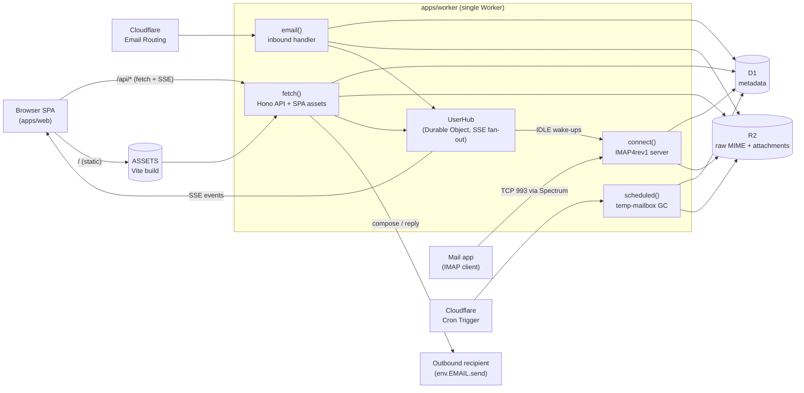

# cloudflare-mail

A self-hostable, Gmail-style mail client that runs entirely on Cloudflare — one Worker serves the React app, the REST API, inbound mail (`email()`), IMAP over inbound TCP (`connect()`), and scheduled cleanup (`scheduled()`).

- **Four mailbox types**, all first-class with RBAC from day one:
  - `personal` — individual inbox
  - `group` — shared inbox with per-user READ / WRITE / MANAGE bit flags
  - `service` — send-only (no-reply style); inbound to these addresses is rejected
  - `temp` — disposable, TTL-based, random local-part, auto-collected by cron
- **Multi-domain** across primary + sub-domains
- **Gmail-style UI** — 3-pane layout, compose dock, SSE-driven live updates
- **Full-text search** over subjects, bodies, and recipients (D1 FTS5)
- **Organization** — labels, folders, reminders, and per-mailbox automation rules
- **Inbound pipeline** — threading, spam scoring, gateway PGP decrypt, one-click unsubscribe, calendar (`.ics`) parsing, blocklist
- **IMAP4rev1 server** — read your mail in Apple Mail, Thunderbird or Outlook, with `IDLE` push, per-mailbox app passwords, and the same RBAC as the web app
- **Push notifications** and a tracking-pixel image proxy
- **Everything on Cloudflare** — no external database, no SMTP servers to run

> Status: actively developed. Auth, RBAC, inbound/outbound mail, threading, search, labels/folders/rules, spam, PGP, reminders, calendar, push, temp GC, and SSE are wired end-to-end, with a Vitest suite covering the worker pipelines. Contributions welcome.
>
> IMAP is built and tested but needs Cloudflare's **inbound TCP for Workers** (private beta at time of writing) plus a Spectrum application to reach it — see [IMAP access](#6-imap-access-optional).

## Stack

| Layer         | Choice                                                             |
| ------------- | ------------------------------------------------------------------ |
| Runtime       | Cloudflare Workers (single Worker: `fetch` + `email` + `scheduled` + `connect` + Durable Objects) |
| Storage       | D1 (SQLite, metadata), R2 (raw MIME + attachments), DO (SSE fan-out) |
| Inbound       | Cloudflare Email Routing → Worker `email()` handler                |
| IMAP          | Cloudflare Spectrum (TLS terminated) → Worker `connect()` handler  |
| Outbound      | Cloudflare Email Service (`env.EMAIL.send()`)                      |
| Auth          | [Better Auth](https://better-auth.com) on D1                       |
| MIME          | [postal-mime](https://github.com/postalsys/postal-mime) (parse), [mimetext](https://github.com/muratgozel/MIMEText) (build for archived copy) |
| API           | [Hono](https://hono.dev) + [Drizzle ORM](https://orm.drizzle.team) |
| Frontend      | React 19, Vite, Tailwind v4, shadcn/ui, TanStack Router + Query    |
| Tooling       | pnpm · Turborepo · Biome v2 · oxlint · tsgo (TypeScript 7)         |

## Architecture

One Worker owns every code path. There is no separate API service, no message queue worker, no static-asset host — just `apps/worker` with the bindings declared in `apps/worker/wrangler.jsonc`.



Bindings the Worker depends on (see `wrangler.jsonc`):

| Binding     | Type            | Purpose                                                          |
| ----------- | --------------- | ---------------------------------------------------------------- |
| `DB`        | D1              | Mailboxes, threads, messages, RBAC, FTS5 search                  |
| `BLOBS`     | R2              | Raw inbound `.eml`, archived sent copies, attachments, drafts    |
| `EMAIL`     | Send Email      | Outbound `env.EMAIL.send()` via Cloudflare Email Sending         |
| `USER_HUB`  | Durable Object  | Per-user SSE fan-out (`message_*`, `mailbox_*` events)           |
| `ASSETS`    | Static Assets   | Vite-built SPA, SPA fallback, `/api/*` routed to Worker first    |
| Cron        | `*/1 * * * *`   | `scheduled()` deletes expired temp mailboxes + their R2 keys     |
| Email route | Email Routing   | `email()` parses inbound, stores in R2/D1, broadcasts via DO     |

## Structure

```
apps/
  web/       # Vite + React 19 SPA (served as Static Assets from the Worker)
  worker/    # Cloudflare Worker — fetch + email + scheduled + UserHub DO
packages/
  db/        # Drizzle schema + D1 migrations
  shared/    # Zod schemas, permission bits, event types
```

Key files to orient from:

- `apps/worker/src/index.ts` — handler exports
- `apps/worker/src/mail/receive.ts`, `apps/worker/src/mail/send.ts` — mail pipelines
- `apps/worker/src/imap/` — IMAP wire protocol, session state machine, mail-model bridge
- `apps/worker/src/permissions.ts` — single RBAC checker
- `apps/worker/src/hub.ts` — SSE fan-out Durable Object
- `packages/db/src/schema.ts` — data model

## Quick start

The goal: fork, connect the repo to Cloudflare, open the URL, create the admin account in the browser. Deploys happen automatically on every push to `main` via Workers Builds — no `wrangler deploy`, no `wrangler secret put`, no editing env vars in `wrangler.jsonc`. Per-domain config (which mailbox kinds, who can create what) is configured in the in-app admin panel.

### 1. Prerequisites

- A Cloudflare account on the **Workers Paid** plan (Email Sending requires it)
- A domain on Cloudflare with **Email Routing** enabled (per email-domain DNS still needs the standard MX + SPF/DKIM/DMARC records — the admin UI shows you what to paste)
- Node 22+, pnpm 10+

### 2. Install

```bash
git clone https://github.com/Newspicel/cloudflare-mail.git
cd cloudflare-mail
pnpm install
```

### 3. Provision resources (one time)

```bash
# D1 database — copy the printed database_id into apps/worker/wrangler.jsonc
pnpm --filter @cfmail/worker exec wrangler d1 create cfmail

# R2 bucket (name is referenced from wrangler.jsonc)
pnpm --filter @cfmail/worker exec wrangler r2 bucket create cfmail-blobs
```

Commit the updated `wrangler.jsonc` (with the new `database_id`) and push.

### 4. Connect the repo to Workers Builds

Deploys are handled by Cloudflare Workers Builds — connect once and every push to `main` builds and ships automatically.

1. Cloudflare dashboard → **Workers & Pages** → your worker → **Settings → Build**.
2. **Connect** your fork of the repo.
3. Set:
   - **Build command:** `pnpm run build`
   - **Deploy command:** `pnpm run deploy`
   - **Root directory:** `/`
   - **Production branch:** `main`
4. Save. The next push to `main` (or a manual "Retry build") builds the web app and Worker, runs the production D1 migrations, and deploys.

That's the whole deploy. The `deploy` script applies pending migrations (`@cfmail/db migrate --remote`) before `wrangler deploy`, so schema changes ship with the code. No secrets to set: the auth secret is lazy-generated on first request and stored in D1 (`system_config`). The app URL is derived from the request `Host` header, so whatever custom domain you bind to the Worker in the Cloudflare dashboard becomes your app URL automatically.

> Prefer the CLI? You can still deploy by hand with `pnpm run deploy` from a checkout authenticated via `wrangler login`.

### 5. First-run setup (in the browser)

1. Bind a custom domain to the deployed Worker (Cloudflare dashboard → Workers → your worker → Custom Domains).
2. Open that URL. The first visit shows a **Create administrator** form — this becomes the system admin.
3. Sign in. From the admin panel:
   - **Domains** tab → add the email domains you'll use, and tick which mailbox kinds each allows (`personal`, `group`, `service`, `temp`). The DNS-health badges and DNS records you need are shown inline.
   - **Users** tab → invite teammates (email link) or create accounts directly. Per-user, per-domain mailbox-kind grants live here.
   - Set the **Transactional email** from-address (must be on a verified Email Sending domain) so password reset and invite emails can go out.
4. In Cloudflare: enable **Email Routing** per zone, route catch-all → this Worker, and verify the zone under **Email Sending**.

### 6. IMAP access (optional)

Mail apps talk to the same Worker over TCP. Cloudflare Spectrum terminates TLS and routes the raw socket to the `connect()` handler, so there is no separate IMAP server to run and no `STARTTLS` — connect on the implicit-TLS port.

1. In the Cloudflare dashboard, create a **Spectrum application**: TCP, port `993`, origin = this Worker. (Inbound TCP for Workers is in private beta — you may need to request access.)
2. In the app's admin panel → **Domains** tab → **IMAP access**, enter that Spectrum hostname and port. Until this is set, the app hides IMAP from users.
3. Each user creates their own credentials in **Settings → IMAP access**: pick a mailbox, name the device, and copy the generated app password (shown once).

Client settings are then: server = the Spectrum hostname, port `993`, SSL/TLS, username = the mailbox address, password = the app password. One password unlocks one mailbox; revoking it cuts that client off immediately, and losing access to a shared mailbox revokes it automatically.

Folders map onto the app's own model: `INBOX`, `Sent`, `Spam`, `Trash`, plus each of your custom folders. Moving mail, flagging it, and deleting it in a mail app shows up in the web UI live, and vice versa.

### 7. Local dev

```bash
pnpm --filter @cfmail/db migrate:local
pnpm dev          # Vite (:5173) + Wrangler (:8787), Vite proxies /api
```

## Verification commands

```bash
pnpm typecheck    # tsgo across all packages
pnpm lint         # oxlint + biome check
pnpm test         # Vitest (worker pipelines + IMAP server)
pnpm build        # Vite + Wrangler dry-run
```

## Contributing

Issues and PRs welcome — see [`CONTRIBUTING.md`](./CONTRIBUTING.md) for branching, required checks, and how to run locally against a real Cloudflare account. TL;DR:

- Keep the toolchain (tsgo / Biome / oxlint / pnpm / Turborepo) — don't swap pieces without discussion.
- Run `pnpm typecheck && pnpm lint && pnpm build && pnpm test` before opening a PR.
- If you use Claude Code or similar AI tooling, read `CLAUDE.md` first — it captures the invariants that make the project safe to change.

## License

[MIT](./LICENSE)
