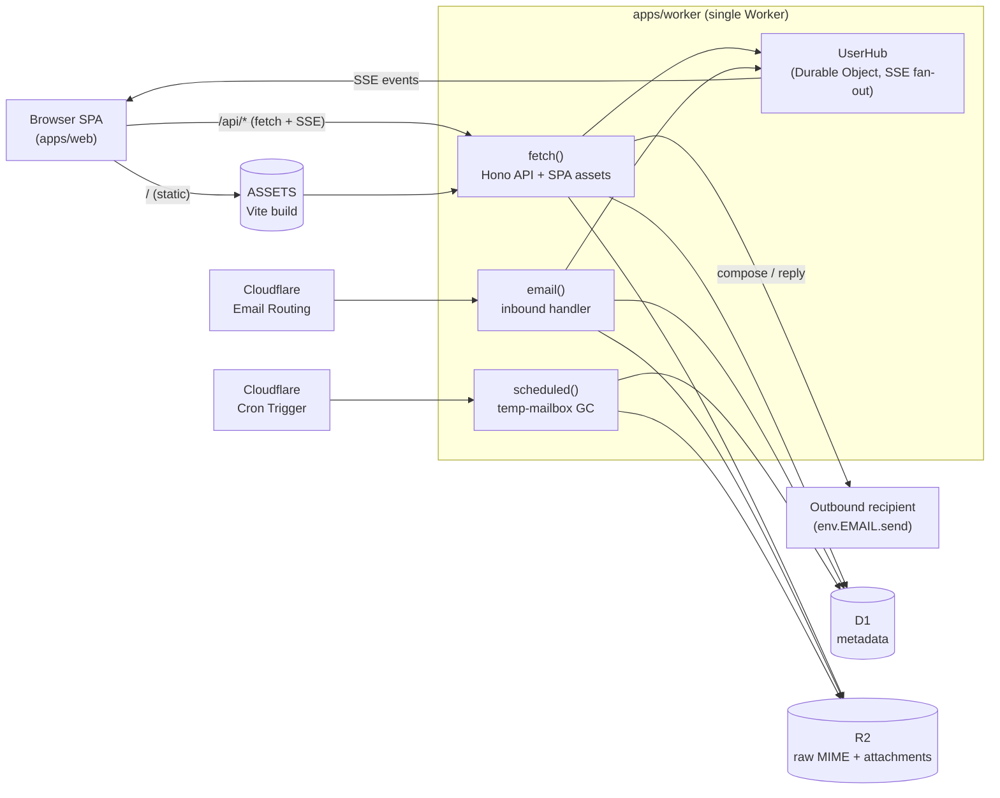

# cloudflare-mail

A self-hostable, Gmail-style mail client that runs entirely on Cloudflare — one Worker serves the React app, the REST API, inbound mail (`email()`), and scheduled cleanup (`scheduled()`).

- **Four mailbox types**, all first-class with RBAC from day one:
  - `personal` — individual inbox
  - `group` — shared inbox with per-user READ / WRITE / MANAGE bit flags
  - `service` — send-only (no-reply style); inbound to these addresses is rejected
  - `temp` — disposable, TTL-based, random local-part, auto-collected by cron
- **Multi-domain** across primary + sub-domains
- **Gmail-style UI** — 3-pane layout, compose dock, SSE-driven live updates
- **Everything on Cloudflare** — no external database, no SMTP servers to run

> Status: early-stage scaffold. The foundation (auth, RBAC, inbound/outbound mail, temp GC, SSE) is wired end-to-end; UI polish, search, and tests are still open. Contributions welcome.

## Stack

| Layer         | Choice                                                             |
| ------------- | ------------------------------------------------------------------ |
| Runtime       | Cloudflare Workers (single Worker: `fetch` + `email` + `scheduled` + Durable Objects) |
| Storage       | D1 (SQLite, metadata), R2 (raw MIME + attachments), DO (SSE fan-out) |
| Inbound       | Cloudflare Email Routing → Worker `email()` handler                |
| Outbound      | Cloudflare Email Service (`env.EMAIL.send()`)                      |
| Auth          | [Better Auth](https://better-auth.com) on D1                       |
| MIME          | [postal-mime](https://github.com/postalsys/postal-mime) (parse), [mimetext](https://github.com/muratgozel/MIMEText) (build for archived copy) |
| API           | [Hono](https://hono.dev) + [Drizzle ORM](https://orm.drizzle.team) |
| Frontend      | React 19, Vite, Tailwind v4, shadcn/ui, TanStack Router + Query    |
| Tooling       | pnpm · Turborepo · Biome v2 · oxlint · tsgo (TypeScript 7)         |

## Architecture

One Worker owns every code path. There is no separate API service, no message queue worker, no static-asset host — just `apps/worker` with the bindings declared in `apps/worker/wrangler.jsonc`.



Bindings the Worker depends on (see `wrangler.jsonc`):

| Binding     | Type            | Purpose                                                          |
| ----------- | --------------- | ---------------------------------------------------------------- |
| `DB`        | D1              | Mailboxes, threads, messages, RBAC, FTS5 search                  |
| `BLOBS`     | R2              | Raw inbound `.eml`, archived sent copies, attachments, drafts    |
| `EMAIL`     | Send Email      | Outbound `env.EMAIL.send()` via Cloudflare Email Sending         |
| `USER_HUB`  | Durable Object  | Per-user SSE fan-out (`message_*`, `mailbox_*` events)           |
| `ASSETS`    | Static Assets   | Vite-built SPA, SPA fallback, `/api/*` routed to Worker first    |
| Cron        | `*/1 * * * *`   | `scheduled()` deletes expired temp mailboxes + their R2 keys     |
| Email route | Email Routing   | `email()` parses inbound, stores in R2/D1, broadcasts via DO     |

## Structure

```
apps/
  web/       # Vite + React 19 SPA (served as Static Assets from the Worker)
  worker/    # Cloudflare Worker — fetch + email + scheduled + UserHub DO
packages/
  db/        # Drizzle schema + D1 migrations
  shared/    # Zod schemas, permission bits, event types
```

Key files to orient from:

- `apps/worker/src/index.ts` — handler exports
- `apps/worker/src/mail/receive.ts`, `apps/worker/src/mail/send.ts` — mail pipelines
- `apps/worker/src/permissions.ts` — single RBAC checker
- `apps/worker/src/hub.ts` — SSE fan-out Durable Object
- `packages/db/src/schema.ts` — data model

## Quick start

### 1. Prerequisites

- A Cloudflare account on the **Workers Paid** plan (Email Service requires it)
- A domain on Cloudflare with **Email Routing** enabled
- Node 22+, pnpm 10+

### 2. Install

```bash
git clone https://github.com/Newspicel/cloudflare-mail.git
cd cloudflare-mail
pnpm install
```

### 3. Provision Cloudflare resources

```bash
# D1 database — copy the returned database_id into apps/worker/wrangler.jsonc
pnpm --filter @cfmail/worker exec wrangler d1 create cfmail

# R2 bucket
pnpm --filter @cfmail/worker exec wrangler r2 bucket create cfmail-blobs

# Apply schema (local dev)
pnpm --filter @cfmail/db generate
pnpm --filter @cfmail/db migrate:local
```

Then in the Cloudflare dashboard:

- Enable **Email Routing** for your domain and point a catch-all (or specific address) to the deployed Worker.
- Enable **Email Sending** and verify your from-domain.
- Generate a Better Auth secret: `openssl rand -base64 32` and store it as a Worker secret (`wrangler secret put BETTER_AUTH_SECRET`).

### 4. Run locally

```bash
pnpm dev          # starts Vite (:5173) and Wrangler (:8787), Vite proxies /api
```

### 5. Deploy

```bash
pnpm --filter @cfmail/db migrate         # production migration
pnpm --filter @cfmail/worker deploy
```

For the full deployment walk-through (DNS, Email Routing, Email Sending verification, secrets, smoke test) see [`docs/DEPLOY.md`](./docs/DEPLOY.md).

## Verification commands

```bash
pnpm typecheck    # tsgo across all packages
pnpm lint         # oxlint + biome check
pnpm build        # Vite + Wrangler dry-run
```

## Contributing

Issues and PRs welcome — see [`CONTRIBUTING.md`](./CONTRIBUTING.md) for branching, required checks, and how to run locally against a real Cloudflare account. TL;DR:

- Keep the toolchain (tsgo / Biome / oxlint / pnpm / Turborepo) — don't swap pieces without discussion.
- Run `pnpm typecheck && pnpm lint && pnpm build && pnpm test` before opening a PR.
- If you use Claude Code or similar AI tooling, read `CLAUDE.md` first — it captures the invariants that make the project safe to change.

## License

[MIT](./LICENSE)
